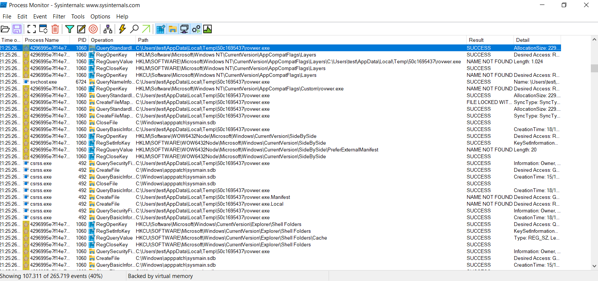
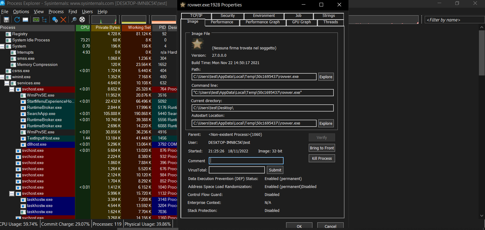
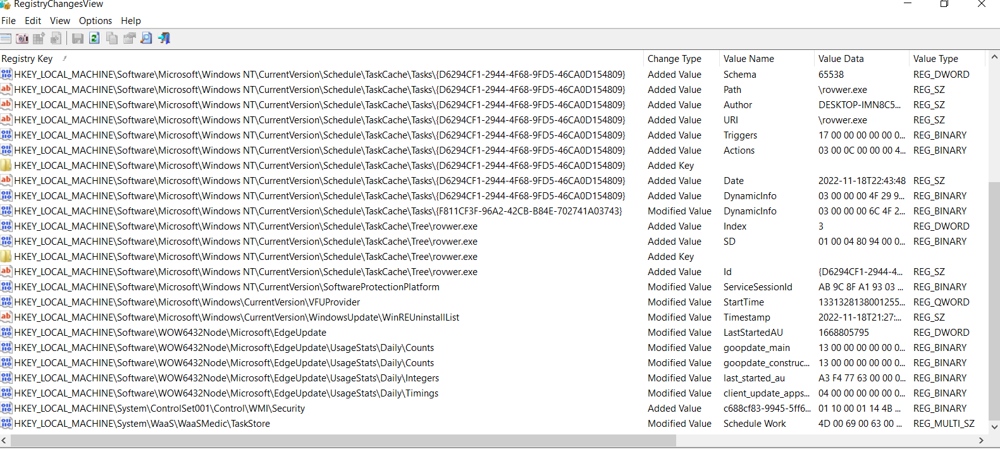

Malware Bazar:
<pre>
sample name: 4296995e7f14e7b456abaabf589ec07a152d295f9155fbe2b1ddd01f710e3762.exe 
md5 hash: f300cd286f233d31193d3509e18a6cbd
</pre>
Basic Static Analysis:

First: Check when it has been compiled

PEview -> IMAGE_FILE_HEADER -> Time Date Stamp 2021/11/22 lun 13:50:17 UTC.

Second: Check if it is packed (it is packed if the size of raw data is more different(large/small) from virtual size)
<pre>
IMAGE_SECTION_HEADER .text -> 	Size of raw data 00013800 
			      	Virtual size     000136F2        (not packed)

IMAGE_SECTION_HEADER .data -> 	Size of raw data 00182D64 
				Virtual size     00020200        (packed)

IMAGE_SECTION_HEADER .rsrc -> 	Size of raw data 00003C00 
				Virtual size     00003C00        (not packed)
</pre>
do another check if it is packed with PEid and Detect it Easy 
ok so, Die and PEid detected (.data) as packed but nothing info about the packer used.

third: Exploring Dynamically Linked Functions with Dependency Walker
<pre>
kernel32.dll -> GetProcAddress
                LoadLibraryA
		VirtualAlloc  (typical function for packer)
 		VirtualFree

other interesting function:
kernel32.dll -> CreateFileA (ok so now we know that create file)
                SetMailslot (maybe it use mailslot to send information in real time to the cnc server)
		GetWindowsDirectory
                GetCPInfo
                EnumCalendarInfoW
		GetMailslotInfo
		isDebuggerPresent (a typical anti-analysis function)
                GetStartupInfoA
                WriteFile
		ReadFile
</pre>
ok now viewing the .rsrc with Resource Hacker
nothing interesting apart incomprehensible strings

Four: View Strings with Bintext
other incomprensible string, but we found an IP: 26.45.78.26 so we can assume
that this malware use internet connection, so it connect to a cnc server.
ok another interesting string: C:\fibuxopotido\jihanamubol\vepunutepir wavaduz.pdb
this is probably the mailslot that it use to send the information.

Basic Dynamic Analysis:

Procmon + FakeNet + RegShot/RegistryChangesView
<pre>
Procmon is used to see process tasks (filecreated, directory created, file deleted, ecc..) 
FakeNet is used to fake a DNS server, so we redirect the dns resolution to 127.0.0.1 and see the requests that malware do 
RegShot/RegistryChangesView is used to see the chenges that malware do in the register. (ex: Persistance HKLM\SOFTWARE\Microsoft\Windows\CurrentVersion\Run)
</pre> 

ProcMon -> (1) the malware create file and open registery (too many to write them) and create an executable with name "rovwer.exe". 
as we can see in the screenshot but to be sure, let's check with Process Explorer..
(2)as we imagined the malware is persistent (autostart location)

RegShot/RegistryChangesView -> we perform the first registry capture without running the malware, next second registry capture and see what is changed (run malware)

these are the changes..
